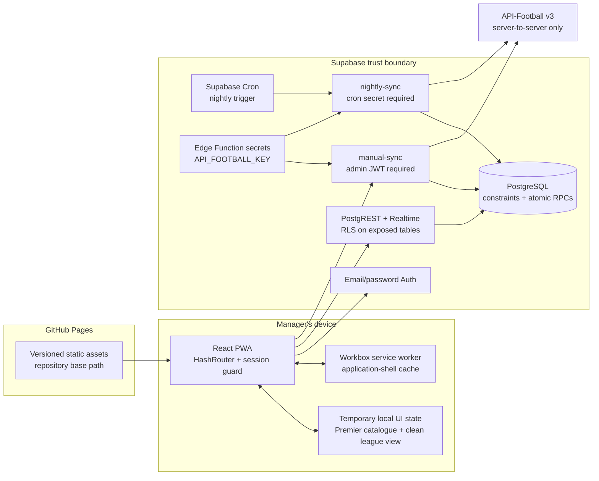
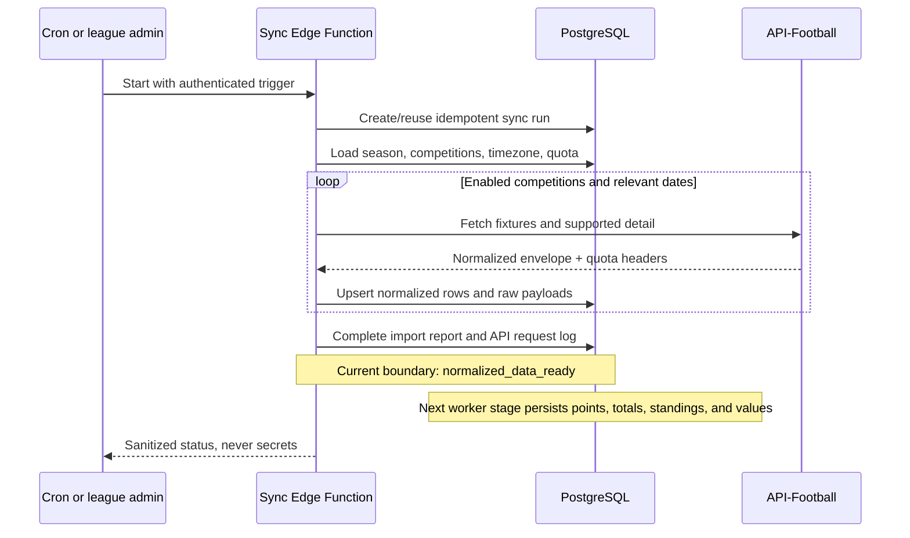

# Architecture

Monkey Managers is split into a static, installable client and a trusted Supabase backend. The browser may render data and request an operation, but it is never the authority for ownership, money, league membership, locked lineups, scoring imports, or provider credentials.

## Account-first client and temporary local state

### Account access

There is no anonymous browser-demo route. `RequireSession` protects onboarding and every `/app` route, so a manager must have a Supabase email/password session before creating, joining, or viewing a private league. If the public Supabase URL or anonymous key is missing, the client shows an account-configuration screen instead of presenting a fictional league.

When `VITE_SUPABASE_URL` and `VITE_SUPABASE_ANON_KEY` are present, the browser can create Supabase Auth sessions and onboarding writes league, invitation, and club records through authenticated Supabase operations. The anonymous key is a public project identifier, not an administrative credential; row-level security remains the real access boundary. All sensitive mutations belong in the database functions or Edge Functions described in [database.md](database.md).

### Temporary local UI state

The primary screens are currently backed by `src/app/demo-store.tsx`, a temporary local UI-state provider retained while authoritative PostgREST/Realtime queries are connected. Its name is historical: it is not an anonymous fictional browser demo and it cannot establish ownership, balances, lineup locks, scores, or league membership.

`src/data/demo.ts` now supplies a bundled real Premier League player and team catalogue with a clean local league view: one newly created club, no inherited managers, ownerships, fixtures, competition totals, or scores. Local market, lineup, activity, and profile interactions are presentation previews stored on the device. They never substitute for the database's atomic operations or its private-league record.

The service-role key and API-Football key must exist only inside Supabase-managed server environments. Neither belongs in a `VITE_*` variable, GitHub Pages artifact, client log, or network request initiated by the browser.

## Frontend structure

The app uses feature-oriented modules:

- `src/app`: composition, product constants, and the temporary local UI-state provider.
- `src/components`: shared shell, badge, and accessible UI primitives.
- `src/features`: route-level authentication, onboarding, home, squad, market, competition, league, club, admin, and system screens.
- `src/domain`: provider-independent scoring, valuation, competition allocation, ranking, market, money, lineup, and synchronisation logic.
- `src/lib`: Supabase client construction and formatting helpers.
- `src/data`: bundled Premier League catalogue and clean local UI baseline. The separate
  fictional development database seed is under `supabase/seed.sql`.
- `src/test`: unit tests for domain behaviour.

`HashRouter` keeps all application routes after `#`, so GitHub Pages only needs to serve the deployed `index.html`. Vite's `base` option prefixes JavaScript, CSS, icons, the manifest, and service-worker resources with the repository path.

TanStack Query is available for connected server state. React Hook Form and Zod validate interactive forms. The PWA plugin generates a manifest and Workbox service worker; the shell is cached and the app includes an explicit offline route.

## Backend boundaries

### PostgreSQL

PostgreSQL owns durable game invariants:

- a partial unique index permits at most one active owner for a real player in a private league;
- exact integer minor units are used for money;
- append-only triggers protect ledgers, ownership history, raw payloads, transfers, idempotency records, and audit logs;
- lock guards reject writes to locked lineups;
- league/season/club scope triggers prevent cross-league records;
- security-definer RPCs perform purchases, releases, transfers, league creation, joining, and club creation atomically;
- RLS limits league-specific rows to active members and administrative rows to league admins.

See [database.md](database.md) for the table map and operation details.

### Edge Functions

The provider adapter in `supabase/functions/_shared` exposes a provider-neutral football data interface. The API-Football implementation owns authentication, quota tracking, timeouts, retries, and request logging. Synchronisation functions are the only components permitted to call the external provider.

The scheduled entry point uses a separate cron secret because it has no end-user session. The manual entry point verifies the caller's JWT and administrator membership. Both use the service role only after their own authorization checks; service-role access bypasses RLS and must never be delegated to the client.

### Synchronisation flow

Fixtures retain the provider fixture ID as the external join point for lineups, events, and player statistics. Upserts and calculation fingerprints make a repeated run safe. The previous three days are rechecked so provider corrections replace prior normalized data rather than duplicating it.

The first-pass Edge Function currently completes at normalized imported data. Pure scoring, competition, ranking, and valuation engines are implemented and tested, and their target tables exist, but the production post-import worker that persists points, lineup aggregation, totals, standings, and values is still to be connected. A successful import therefore is not evidence that connected league scores or prices were recalculated. The fictional local Supabase seed can exercise those target tables for development, but it is separate from the account-first browser view.

## Security model

The main trust assumptions are:

1. Browser input is untrusted, even after authentication.
2. League membership is checked in PostgreSQL for every exposed league-scoped row.
3. Administrative authorization is rechecked at the Edge Function or RPC boundary.
4. Public Supabase credentials may ship to the browser; service credentials and provider secrets may not.
5. Raw provider data is evidence, not automatically valid game data. Normalization must validate types and preserve missing values as null.
6. Operation IDs and calculation fingerprints make retries observable and idempotent.

Temporary local UI state deliberately operates outside this trust model. It is useful for the current interface while connected queries are being wired, but it is never mixed with authoritative ledger, ownership, lineup, or scoring data.

## Deployment topology

GitHub Pages hosts only static frontend files. Supabase owns authentication callbacks, database access, functions, secrets, and scheduled execution. A Pages deployment needs the public Supabase URL and anonymous key to unlock the account-first routes. This separation means it cannot leak the provider key unless someone explicitly puts that secret into frontend source, a `VITE_*` environment variable, or a public workflow log.

The CI workflow tests a non-root base path. The Pages workflow derives `/REPOSITORY_NAME/` for project sites and `/` for `USERNAME.github.io` user sites. Deployment details and authentication redirect settings are in [deployment.md](deployment.md).
